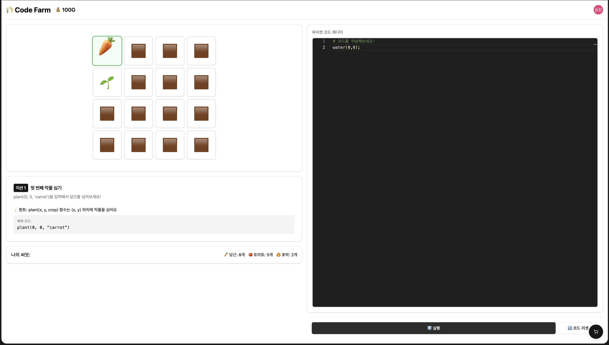

# 🌾 Code Farm

파이썬 코드로 농장을 키우는 코딩 교육 게임

## 프로젝트 설명

Code Farm은 파이썬 문법을 게임처럼 배울 수 있는 웹 기반 교육 게임입니다.

- **실제 파이썬 문법** (`for`, `if`, `while`) 을 사용해 농장을 자동화
- **농장 전용 함수** (`plant()`, `water()`, `harvest()`) 로 작물 관리
- **단계별 미션**으로 프로그래밍 기초 학습

```python
# 예시: 첫 번째 줄에 당근 심기
for x in range(4):
    plant(x, 0, "carrot")
```

## 기술 스택

- React 18 + TypeScript
- Tailwind CSS + shadcn/ui
- Monaco Editor (코드 에디터)
- OpenAI API (코드 해석)
- Vite

## AI에게 전달한 초기 요구사항

```
# Code Farm - 코딩 교육 농장 게임

## 프로젝트 개요
스타듀밸리, 동물의 숲 등 농장 시뮬레이션 게임에서 영감을 받아,
"코딩으로 농장을 자동화한다"는 교육적 컨셉의 웹 게임을 개발합니다.

## 핵심 요구사항
### 1. 게임 메카닉
- 4x4 그리드 기반 농장 시스템
- 작물 심기 → 성장 → 수확의 기본 루프
- 골드 기반 경제 시스템 (씨앗 구매, 작물 판매)
### 2. 교육적 요소 (핵심 차별점)
- 파이썬 문법을 활용한 농장 자동화
- 기본 문법 유지: for, if, while, 변수, 함수 호출
- 농장 전용 API 함수 설계:
  - plant(x, y, crop): 작물 심기
  - water(x, y): 물 주기
  - harvest(x, y): 수확
  - is_ready(x, y): 수확 가능 여부 확인
- 단계별 미션으로 프로그래밍 개념 학습 유도

### 3. 기술 스택
- Frontend: React 18, TypeScript, Vite
- UI: Tailwind CSS, shadcn/ui
- Code Editor: Monaco Editor
- AI Integration: OpenAI API (코드 파싱 및 실행)

### 4. MVP 범위 (2시간 내 구현)
- 농장 그리드 UI 및 상태 시각화
- 코드 에디터 통합
- 기본 함수 (plant, water, harvest) 동작
- for문을 활용한 반복 작업 지원
- 최소 1개 튜토리얼 미션

## 성공 기준
- 사용자가 파이썬 코드를 작성하고 실행할 수 있음
- 코드 실행 결과가 농장 UI에 즉시 반영됨
- 게임을 통해 for문, 함수 호출 개념을 자연스럽게 학습할 수 있음

이걸 기반으로 PRD.md를 작성해줘.

(PRD 작성 이후)
이 PRD를 바탕으로 TODO.md를 작성해주고, markdown의 체크박스를 활용해서 각 페이즈에 어떤 테스크를 완료했는지 확인할 수 있도록 만들어줘.
각 테스크가 끝나면 진행상황을 알 수 있도록 체크박스에 표시해줘.
```

## 서비스 화면




